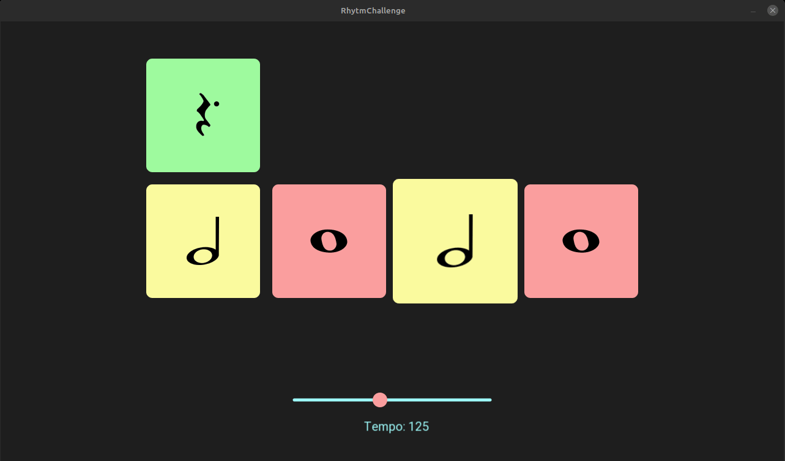

# Rhythm Challenge

Desenvolvi este jogo simples para me ajudar a estudar guitarra. Foi desenvolvido em C++ e utilizei a biblioteca SFML. O jogo basicamente visa treinar o ritmo junto junto com o acompanhamento do metronomo na hora de tocar. O jogo faz isso apresentando sequências de notas na tela que devem ser tocadas respeitando um BPM estabelecido.

## Funcionamento

- **Compasso 4/4:** O jogo utiliza o padrão de compasso 4/4

- **Notas em Sequência:** São apresentadas 4 notas em sequência que devem ser tocadas respeitando o BPM estabelecido.

- **Ajuste de BPM:** É possível ajustar o BPM do jogo.

- **Troca Aleatória de Notas:** Ao final de cada compasso as notas são trocadas aleatoriamente.  O jogador sempre tem conhecimento da primeira nota do próximo compasso.

## Requisitos

- Compilador C++
- SFML
- Linux

## Compilação e Execução

   
  
`git clone https://github.com/VitorTz/Rhythm-Challenge.git`

`cd Rhythm-Challenge`

`make`

`./build/apps/a.out`

